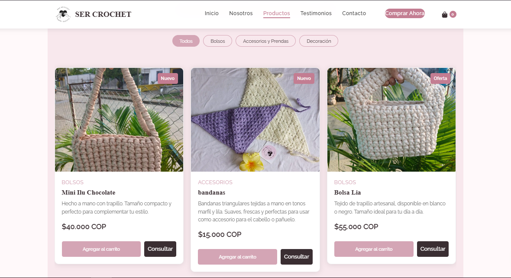
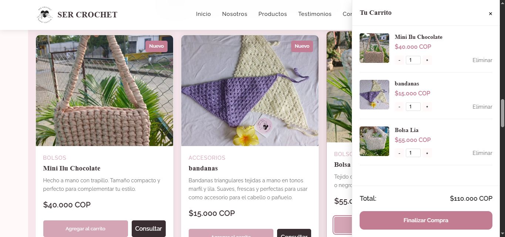
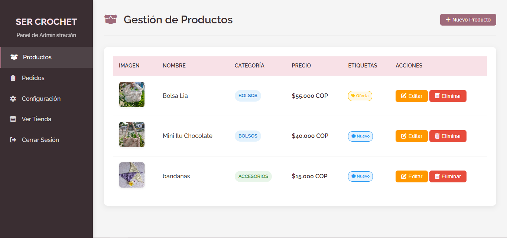

# 🧶 SER CROCHET - E-commerce Artesanal

**SER CROCHET** es una tienda online de productos artesanales en crochet, hechos a mano en Colombia con materiales ecológicos.  
Incluye carrito de compras, panel de administración y autenticación con Firebase.


---

## 🚀 Características
- **Página principal** con catálogo dinámico de productos desde Firestore.
- **Filtro por categorías**: Bolsos, Accesorios y Prendas, Decoración.
- **Carrito de compras** persistente en `localStorage` y sincronizado con Firebase.
- **Checkout vía WhatsApp** con resumen del pedido.
- **Panel de administración** para agregar, editar y eliminar productos.
- **Login seguro** para administradores con Firebase Authentication.
- **Gestión de etiquetas** de producto: Destacado, Más vendido, Nuevo, Oferta.
- **Responsive** y optimizado para móviles.
- **Animaciones AOS** y carrusel Swiper.
- **Configuración PWA** (iconos, manifest).

---

## 📂 Estructura del proyecto
```
ser-crochet-ecommerce/
│
├── public/
│   ├── admin/
│   │   ├── admin.html              # Panel de administración
│   │   └── login.html              # Inicio de sesión para administradores
│   │
│   ├── css/
│   │   ├── admin.css
│   │   ├── login.css
│   │   ├── styles.css
│   │   └── img/                    # Imágenes del sitio
│   │
│   ├── js/
│   │   ├── admin.js
│   │   ├── auth.js
│   │   ├── firebase-config.js
│   │   └── main.js
│   │
│   ├── 404.html
│   ├── CATALOGO-SER-CROCHET-2025.pdf
│   ├── gracias.html
│   ├── index.html                  # Página principal
│   └── manifest.webmanifest        # Configuración PWA
│
├── .firebaserc
├── .gitignore
├── firebase.json
└── README.md
```

---

## ⚙️ Tecnologías utilizadas
- **HTML5**, **CSS3**, **JavaScript**
- [Firebase](https://firebase.google.com/) (Auth, Firestore, Storage)
- [Swiper.js](https://swiperjs.com/) (Carrusel de productos)
- [AOS](https://michalsnik.github.io/aos/) (Animaciones al hacer scroll)
- **PWA Ready** (Manifest, iconos, meta tags)

---

## 📦 Instalación y configuración

### 1. Clonar el repositorio
```bash
git clone https://github.com/Brayan-palacio/ser-crochet-ecommerce.git
cd ser-crochet-ecommerce
```

### 2. Configurar Firebase
- Crea un proyecto en [Firebase Console](https://console.firebase.google.com/).
- Habilita **Authentication (Email/Password)**.
- Habilita **Firestore Database**.
- Habilita **Firebase Storage** (opcional, para subir imágenes).
- Copia las credenciales de configuración en:
  - `/public/js/firebase-config.js`
  - `/public/js/auth.js`

### 3. Reglas de seguridad Firestore
```javascript
rules_version = '2';
service cloud.firestore {
  match /databases/{database}/documents {
    match /products/{product} {
      allow read: if true;
      allow write: if request.auth != null;
    }
    match /userCarts/{userId} {
      allow read, write: if request.auth != null && request.auth.uid == userId;
    }
  }
}
```

### 4. Iniciar servidor local
Puedes usar **Live Server** (VS Code) o un servidor simple:
```bash
npx serve
```

---

## 🖥️ Uso

### Página principal
- Navega por el catálogo de productos.
- Filtra por categoría.
- Agrega productos al carrito.
- Finaliza la compra enviando el pedido por WhatsApp.

### Panel de administración
1. Ve a `public/admin/login.html` e inicia sesión con un usuario registrado en Firebase Auth.
2. Agrega nuevos productos completando:
   - Nombre, categoría, precio, descripción.
   - URL de la imagen.
   - Etiquetas (Destacado, Más vendido, Nuevo, Oferta).
3. Edita o elimina productos existentes.

---

## 🔒 Seguridad
- El panel de administración está protegido: solo usuarios autenticados pueden acceder.
- Las reglas de Firestore permiten escribir solo si el usuario está autenticado.

---

## 📸 Capturas de pantalla

### Página principal


### Carrito


### Panel de administración


---

## 📌 Próximas mejoras
- Guardar pedidos en Firestore además de enviarlos por WhatsApp.
- Subir imágenes directamente a Firebase Storage.
- Gestión de roles (admin / cliente).
- Integración con pasarelas de pago (MercadoPago, PayU).

---

## 📄 Licencia
Este proyecto está bajo la licencia MIT. Puedes usarlo, modificarlo y distribuirlo libremente.

---

💙 **SER CROCHET** — Hecho con amor y código en Colombia 🇨🇴
